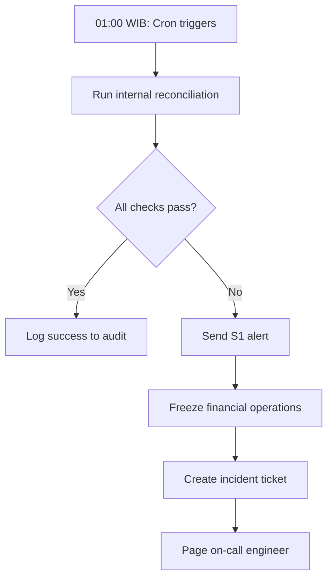

# Reconciliation Procedures

## Overview
Reconciliation ensures financial accuracy by verifying internal ledgers match external sources (bank statements, payment gateways). Performed daily and on-demand.

## Types of Reconciliation

### 1. Internal Reconciliation
**Frequency**: Daily at 01:00 WIB (automated)

**Purpose**: Verify internal consistency (wallets vs ledger)

**Command**:
```bash
php artisan reconcile:internal --date=2026-01-11
```

**Checks**:
- Wallet balances match ledger sums (Invariant I-001)
- Platform solvency (Invariant I-002)
- Escrow holds (Invariant I-003)
- No negative balances (Invariant I-006)

**Output**:
```json
{
    "date": "2026-01-11",
    "status": "PASS",
    "checks": {
        "wallet_consistency": "PASS",
        "platform_solvency": "PASS",
        "escrow_conservation": "PASS",
        "negative_balances": "PASS"
    },
    "summary": {
        "total_wallets_checked": 15420,
        "total_balance": 8750000000.00,
        "escrow_held": 1200000000.00,
        "available_balance": 7550000000.00
    }
}
```

---

### 2. Payment Gateway Reconciliation
**Frequency**: Daily (manual review)

**Purpose**: Match internal deposits/withdrawals with gateway transactions

**Gateways**:
- Midtrans (deposits via credit card, e-wallet)
- Xendit (bank transfers, virtual accounts)

**Procedure**:

1. **Export internal transactions**:
   ```bash
   php artisan reconcile:export-gateway \
       --gateway=midtrans \
       --date=2026-01-11 \
       --output=/tmp/internal_midtrans.csv
   ```

2. **Download gateway report**:
   - Login to Midtrans dashboard
   - Reports → Transaction Report → Daily
   - Download CSV for 2026-01-11

3. **Compare files**:
   ```bash
   php artisan reconcile:compare-gateway \
       --internal=/tmp/internal_midtrans.csv \
       --external=/tmp/midtrans_report_20260111.csv \
       --output=/tmp/discrepancies.csv
   ```

4. **Review discrepancies**:
   - Missing in internal: Failed webhook (retry)
   - Missing in external: Fraudulent entry (investigate)
   - Amount mismatch: Currency conversion or fee issue

5. **Resolve discrepancies**:
   ```bash
   # Create manual adjustment (maker-checker required)
   php artisan ledger:adjust \
       --wallet-id=12345 \
       --amount=-50000 \
       --reason="Midtrans fee not captured" \
       --evidence="/uploads/midtrans_statement.pdf"
   ```

---

### 3. Bank Statement Reconciliation
**Frequency**: Weekly (Mondays)

**Purpose**: Verify platform bank account matches internal tracking

**Procedure**:

1. **Download bank statement** (PDF or CSV)

2. **Extract transactions**:
   ```bash
   php artisan bank:parse-statement \
       --file=/uploads/bca_statement_20260106-20260112.pdf \
       --bank=BCA \
       --output=/tmp/bank_transactions.csv
   ```

3. **Match with internal withdrawals**:
   ```bash
   php artisan reconcile:bank-match \
       --bank-file=/tmp/bank_transactions.csv \
       --date-from=2026-01-06 \
       --date-to=2026-01-12
   ```

4. **Investigate unmatched**:
   - Bank transaction without internal record: Duplicate bank entry or missing deposit
   - Internal record without bank transaction: Pending transfer or failed payout

5. **Document findings**:
   ```bash
   php artisan reconcile:finalize \
       --type=bank \
       --period=2026-W02 \
       --notes="3 pending payouts, matched 247/250 transactions"
   ```

---

### 4. Escrow-to-Ledger Reconciliation
**Frequency**: Daily at 01:00 WIB (automated)

**Purpose**: Ensure escrow state changes reflected in ledger

**Command**:
```bash
php artisan reconcile:escrow --date=2026-01-11
```

**Checks**:
- Every FUNDED escrow has ESCROW_HOLD entry
- Every COMPLETED escrow has ESCROW_RELEASE entry
- Every CANCELLED escrow has ESCROW_REFUND entry
- Sum of held escrows = sum of active HOLD entries

**Output**:
```json
{
    "date": "2026-01-11",
    "status": "PASS",
    "escrows_checked": 342,
    "discrepancies": [],
    "summary": {
        "funded": 89,
        "completed": 201,
        "cancelled": 23,
        "disputed": 5
    }
}
```

---

## Reconciliation Workflow

### Daily Workflow (Automated)



### Weekly Workflow (Manual)

1. **Monday 09:00**: Finance team downloads bank statement
2. **Monday 10:00**: Run bank reconciliation script
3. **Monday 11:00**: Review discrepancies with engineering
4. **Monday 14:00**: Resolve issues, create adjustments if needed
5. **Monday 16:00**: Finalize and sign-off reconciliation report

### Monthly Workflow (Audit)

1. **1st of month**: Generate monthly reconciliation report
2. **3rd of month**: CFO reviews and approves
3. **5th of month**: Submit to external auditor (if applicable)
4. **10th of month**: Auditor feedback incorporated

---

## Discrepancy Resolution

### Decision Tree

```
Discrepancy detected
├── Missing transaction internally
│   ├── Check webhook logs
│   ├── Retry webhook if failed
│   └── Create manual entry if legitimate
├── Missing transaction externally
│   ├── Check for duplicate internal entry
│   ├── Investigate fraud if suspicious
│   └── Reverse if confirmed fraudulent
├── Amount mismatch
│   ├── Check for currency conversion
│   ├── Verify fee calculations
│   └── Adjust if calculation error
└── Timing mismatch
    ├── Check for pending transactions
    ├── Wait 24h for settlement
    └── Re-reconcile next day
```

### Manual Adjustment Procedure

**Requires**: Maker-checker approval + step-up auth

```bash
# Step 1: Maker creates adjustment
php artisan ledger:adjust:create \
    --wallet-id=12345 \
    --amount=-1000 \
    --reason="Bank fee not captured" \
    --evidence="/uploads/bank_statement.pdf" \
    --maker-admin-id=5

# Returns: adjustment_id=789

# Step 2: Checker reviews and approves
php artisan ledger:adjust:approve \
    --adjustment-id=789 \
    --checker-admin-id=7 \
    --notes="Verified against bank statement, approved"

# Step 3: Automatic execution after approval
# Creates ledger entry with transaction_type='MANUAL_ADJUSTMENT'
```

---

## Reconciliation Reports

### Daily Report Template

```markdown
# Daily Reconciliation Report
**Date**: 2026-01-11
**Prepared by**: [Engineer Name]
**Reviewed by**: [Finance Lead]

## Summary
- Status: ✅ PASS / ❌ FAIL
- Wallets checked: 15,420
- Total balance: Rp 8,750,000,000
- Escrow held: Rp 1,200,000,000
- Discrepancies: 0

## Invariants Checked
| Code | Description | Status |
|------|-------------|--------|
| I-001 | Wallet consistency | ✅ PASS |
| I-002 | Platform solvency | ✅ PASS |
| I-003 | Escrow conservation | ✅ PASS |
| I-006 | No negative balances | ✅ PASS |

## Transactions Summary
- Deposits: 1,247 (Rp 342,500,000)
- Withdrawals: 863 (Rp 289,100,000)
- Escrow created: 89 (Rp 67,800,000)
- Escrow completed: 201 (Rp 145,200,000)

## Issues
None

## Actions Required
None

## Sign-off
- Engineering: [Signature]
- Finance: [Signature]
```

### Monthly Report Template

```markdown
# Monthly Reconciliation Report
**Period**: January 2026
**Prepared by**: Finance Team
**Approved by**: CFO

## Executive Summary
- Days reconciled: 31/31 (100%)
- Successful reconciliations: 31
- Failed reconciliations: 0
- Total transaction volume: Rp 27,5B
- Outstanding discrepancies: 0

## Transaction Breakdown
| Type | Count | Amount (Rp) |
|------|-------|-------------|
| Deposits | 38,457 | 10,547,000,000 |
| Withdrawals | 26,831 | 8,923,000,000 |
| Escrows created | 2,745 | 2,104,000,000 |
| Escrows completed | 6,203 | 4,489,000,000 |
| Fees collected | 38,457 | 526,000,000 |

## Gateway Reconciliation
- Midtrans: 98.7% auto-matched
- Xendit: 99.2% auto-matched
- Manual adjustments: 3 (total Rp 45,000)

## Bank Reconciliation
- Statements reviewed: 4 (weekly)
- Matched transactions: 99.4%
- Pending payouts: 12 (Rp 3,200,000)
- Unmatched: 0

## Audit Trail
- Adjustment entries: 3
- Maker-checker approvals: 3/3 (100%)
- Step-up authentications: 6/6 (100%)

## Risks & Mitigations
None identified

## Recommendations
1. Continue current procedures
2. No action required

## Approvals
- Finance Lead: [Signature] [Date]
- CFO: [Signature] [Date]
```

---

## Tools & Commands

### Available Commands

```bash
# Internal reconciliation
php artisan reconcile:internal [--date=YYYY-MM-DD] [--tenant=ID]

# Gateway reconciliation
php artisan reconcile:gateway --gateway=midtrans --date=YYYY-MM-DD

# Bank reconciliation
php artisan reconcile:bank --period=YYYY-MM-DD:YYYY-MM-DD

# Escrow reconciliation
php artisan reconcile:escrow [--date=YYYY-MM-DD]

# Export for manual review
php artisan reconcile:export --type=TYPE --date=YYYY-MM-DD --output=FILE

# Manual adjustment (maker)
php artisan ledger:adjust:create --wallet-id=ID --amount=AMOUNT --reason=TEXT

# Manual adjustment (checker)
php artisan ledger:adjust:approve --adjustment-id=ID --checker-admin-id=ID

# Generate report
php artisan reconcile:report --period=daily|weekly|monthly --date=YYYY-MM-DD
```

---

## Compliance

### Audit Requirements

- **Daily**: Automated reconciliation logs retained 7 years
- **Weekly**: Bank statement reconciliation documented
- **Monthly**: Comprehensive report with CFO sign-off
- **Annually**: External auditor review

### Evidence Preservation

- All reconciliation reports: 7 years
- Bank statements: 7 years
- Gateway transaction reports: 7 years
- Manual adjustments: Permanent (audit log)
- Discrepancy resolutions: Permanent

---

## Best Practices

1. **Never skip reconciliation**: Even if "everything looks fine"
2. **Investigate all discrepancies**: No matter how small
3. **Document everything**: Every adjustment, every decision
4. **Automate where possible**: Reduce human error
5. **Review trends**: Patterns indicate systemic issues
6. **Separation of duties**: Maker ≠ Checker
7. **Regular audits**: Internal quarterly, external annually

---

## Contact

For reconciliation questions:
- **Primary**: Finance Lead
- **Technical**: DevOps Lead
- **Escalation**: CFO
- **Discrepancies**: Activate incident response (S2)
